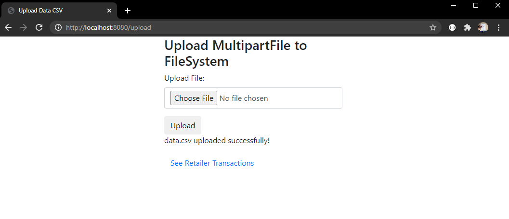
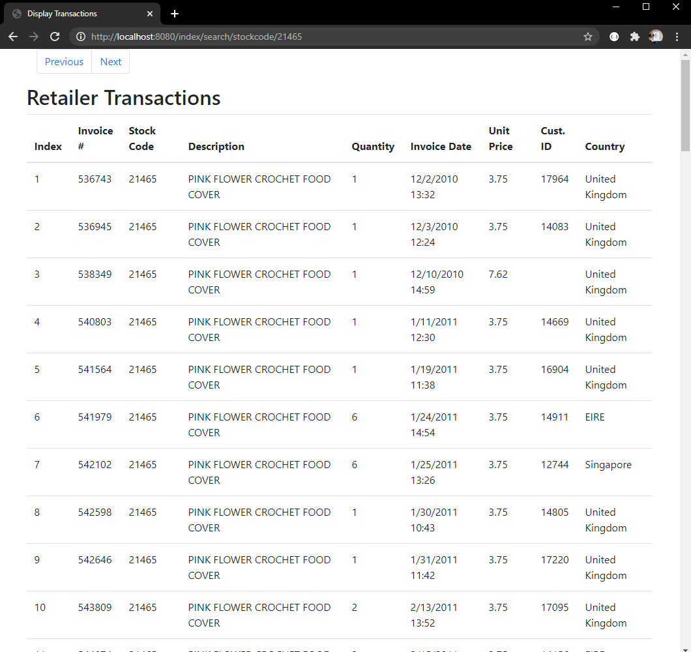

# KotlinSpringboot
This Kotlin Spring Boot app is able to do the following:
1. Upload data.csv file
2. List the data from the uploaded data.csv file with pagination (next and previous pages)
3. Search data from the uploaded data.csv file. 

* The frontend is very basic - Thymeleaf templates and Bootstrap 4
* To run the Spring Boot app, download the zipped folder of this entire project or simply git clone this repository
```
git clone https://github.com/Melvynkoh94/KotlinSpringboot.git
```

On CMD, run the following command:
```
gradlew bootRun
```


[Link to homepage](http://localhost:8080/upload):
This Spring Boot app is configured to port 8080, and the homepage is this particular URL - http://localhost:8080/upload

##Steps

####Home


####data.csv Uploaded


####Transaction List-All Page
Once "See Retailer Transactions" is clicked, it'll show all the whole list of transactions form the data.csv uploaded


####Transaction Pagination
The URL pattern for the page number REST call is as such /index/{page number}/{number of rows}


####Searching for Transaction - Country
URL Pattern: /index/search/{column header}/{search}


####Searching for Transaction - Stockcode
URL Pattern: /index/search/{column header}/{search}


